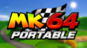
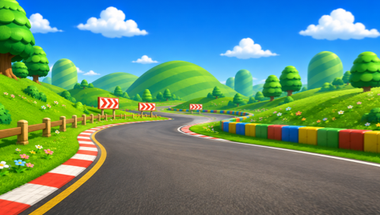

<p align="center"></p>

# MK64 Portable

A native PSP port of Mario Kart 64 running at full speed (30 FPS). 
Built on the [n64decomp/mk64](https://github.com/n64decomp/mk64) decompilation. The game's
C code runs directly on the PSP's MIPS CPU; the N64-specific layers (libultra,
the RSP graphics microcode, the RSP audio microcode) are replaced by a port
layer that drives the PSP's Graphics Engine and audio hardware.

**The EBOOT contains no game data.** On the first start it reads a Mario Kart 64
(USA) ROM that you provide and builds the game data from it. This is an
unofficial fan project, not affiliated with or endorsed by Nintendo.

This was created using Claude Fable5. If you do not want AI code on your PSP, this is 
not a project for you.

<p align="center"></p>

## Features

- Runs at a locked 30 fps on every PSP model, including the PSP-1000 (32 MB)
- All cups and courses: Grand Prix, Time Trial and Versus
- Widescreen 16:9 presentation on the PSP's 480x272 screen
- Music, sound effects and the announcer, mixed on the PSP
- Hardware-accelerated rendering: the N64 display lists are translated to the
  PSP's Graphics Engine, which does the vertex transform and rasterisation
- Saves (Grand Prix progress, ghosts) kept on the Memory Stick

## Installing

You need a PSP that can run homebrew (custom firmware such as ARK-4) and your
own copy of *Mario Kart 64* (USA) as an N64 ROM image (`.z64`, `.n64` or
`.v64` — any byte order works; the file name does not matter).

1. Create `ms0:/PSP/GAME/MK64/` on the Memory Stick and copy `EBOOT.PBP` into it.
2. Copy your ROM into the same folder.
3. Start *MK64 Portable* from the XMB.

The first start shows a progress screen while the game data is built from the
ROM and cached as `assets.bin` next to the EBOOT (about 13 MB). Later starts
skip this. If the ROM is missing, is another game, or is not the USA version,
the port says so and returns to the XMB; nothing is cached from a bad ROM.

Only the USA (NTSC) version is supported.

## Building from source

Requirements: the [pspdev](https://pspdev.github.io/) toolchain, GNU make 4
(`gmake` on macOS), CMake and Ninja for the asset extractor, Python 3 with
Pillow, and a Mario Kart 64 (USA) ROM.

```sh
git clone --recursive <this repository>
cd psp_mk64_portable
cp /path/to/your/rom.z64 baserom.us.z64

# host tools and asset extraction (once)
gmake -C tools mio0 n64graphics displaylist_packer n64cksum tkmk00 extract_data_for_mio
python3 extract_assets.py us
cmake -S tools/torch -B tools/torch/cmake-build-release -G Ninja \
      -DCMAKE_PROJECT_INCLUDE="$PWD/tools/psp/torch_fmt_fix.cmake" && cmake --build tools/torch/cmake-build-release
tools/torch/cmake-build-release/torch code   baserom.us.z64
tools/torch/cmake-build-release/torch header baserom.us.z64

# the PSP build
export PATH="$HOME/pspdev/bin:$PATH"
gmake -f Makefile.psp -j8            # -> build/psp/EBOOT.PBP
gmake -f Makefile.psp release        # clean build without the FPS counter -> release/EBOOT.PBP
```

Run the result in PPSSPP or on a PSP exactly like a release: put a ROM next to
`EBOOT.PBP`. The stock `Makefile` still builds the original N64 ROM.

### How the port works

| N64 mechanism | Port replacement |
| --- | --- |
| libultra (threads, message queues, DMA, VI/AI/SI, EEPROM) | `src/port/ultra_shim.c` — single-threaded, non-blocking queues; the save is a file |
| RSP graphics microcode (F3DEX display lists) | `src/port/gfx/gfx_pc.c`, an F3DEX interpreter, driving `src/port/psp/gfx_scegu.c` (sceGu) with the GE doing transform and lighting |
| RSP audio microcode | `src/port/audio/mixer.c`, a C mixer fed by the game's own `synthesis.c`; `src/port/psp/audio_out.c` resamples to the PSP's 32 kHz output |
| Segmented addressing | `src/port/segments.c` plus generated offset-to-symbol tables |

### Shipping without game data

The objects that hold ROM-derived data are linked into a region the executable
carries no bytes for. At build time, `tools/psp/make_assets.py` extracts that
region from a companion link and `tools/psp/derive_recipes.py` works out, for
every one of its 20,703 symbols, how the bytes derive from the ROM — a raw
range, a compressed block, a byte-order or field pattern, or a slice of a
course's packed display lists. The result (`tools/psp/recipes.json`, numbers
only) is compiled by `tools/psp/emit_recipes.py` into a table that rides in the
EBOOT's `DATA.PSAR`. On the first start `src/port/psp/assets_gen.c` executes
that table against the player's ROM using the game's own decoders, checks the
result against a CRC, and caches it. `gmake -f Makefile.psp assets-recipes`
regenerates the recipes when the set of assets changes; a build with
`EXTRA_CFLAGS=-DPORT_ASSETS_VERIFY` compares an extraction symbol by symbol
against the build-time archive.

## Acknowledgements

- [n64decomp/mk64](https://github.com/n64decomp/mk64) — the decompilation this port is built on
- [sm64-port](https://github.com/sm64-port/sm64-port) — the F3DEX interpreter and audio mixer this port started from
- [SpaghettiKart](https://github.com/HarbourMasters/SpaghettiKart) and [Torch](https://github.com/HarbourMasters/torch) — the asset extraction and a reference for the game's audio commands
- [pspdev](https://github.com/pspdev) — the PSP toolchain and SDK

Mario Kart 64 is a trademark of Nintendo. This project is not affiliated with
or endorsed by Nintendo, and it does not include any of the game's assets.
